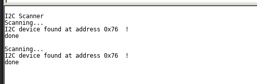
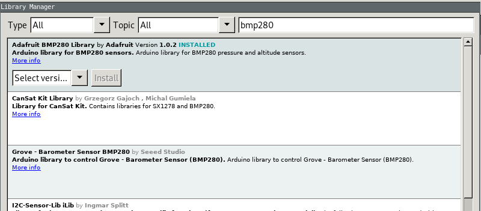

## Plugging the BMP280 sensor to the boards

Do not unplug anything (apart from the GPIO16-RST bridge)
And add another sensor to the system:


## running i2cscan
Lets run an i2c scanner sketch, that I usually use to test if I've plugged the sensor (or other peripherial) via I2C/TWI correctly.
```
// --------------------------------------
// i2c_scanner
//
// Version 1
//    This program (or code that looks like it)
//    can be found in many places.
//    For example on the Arduino.cc forum.
//    The original author is not know.
// Version 2, Juni 2012, Using Arduino 1.0.1
//     Adapted to be as simple as possible by Arduino.cc user Krodal
// Version 3, Feb 26  2013
//    V3 by louarnold
// Version 4, March 3, 2013, Using Arduino 1.0.3
//    by Arduino.cc user Krodal.
//    Changes by louarnold removed.
//    Scanning addresses changed from 0...127 to 1...119,
//    according to the i2c scanner by Nick Gammon
//    http://www.gammon.com.au/forum/?id=10896
// Version 5, March 28, 2013
//    As version 4, but address scans now to 127.
//    A sensor seems to use address 120.
// Version 6, November 27, 2015.
//    Added waiting for the Leonardo serial communication.
//
//
// This sketch tests the standard 7-bit addresses
// Devices with higher bit address might not be seen properly.
//

#include <Wire.h>


void setup()
{
  Wire.begin();

  Serial.begin(115200);
  while (!Serial);             // Leonardo: wait for serial monitor
  Serial.println("\nI2C Scanner");
}


void loop()
{
  byte error, address;
  int nDevices;

  Serial.println("Scanning...");

  nDevices = 0;
  for(address = 1; address < 127; address++ )
  {
    // The i2c_scanner uses the return value of
    // the Write.endTransmisstion to see if
    // a device did acknowledge to the address.
    Wire.beginTransmission(address);
    error = Wire.endTransmission();

    if (error == 0)
    {
      Serial.print("I2C device found at address 0x");
      if (address<16)
        Serial.print("0");
      Serial.print(address,HEX);
      Serial.println("  !");

      nDevices++;
    }
    else if (error==4)
    {
      Serial.print("Unknown error at address 0x");
      if (address<16)
        Serial.print("0");
      Serial.println(address,HEX);
    }    
  }
  if (nDevices == 0)
    Serial.println("No I2C devices found\n");
  else
    Serial.println("done\n");

  delay(5000);           // wait 5 seconds for next scan
}

```

If everything went well you should see something like this:


Note down the sensor address `0x76` as it sometimes changes from board to board.

## Library for BMP280
Now we'll find a suitable library for the BMP280 sensor. Use library manager to find one provided by Adafruit.


And let's open `Examples->Adafruit BMP280 Library->bmp280test`
and modify the baudrate in the `Serial.begin` function to `115200`
```
/***************************************************************************
  This is a library for the BMP280 humidity, temperature & pressure sensor

  Designed specifically to work with the Adafruit BMEP280 Breakout
  ----> http://www.adafruit.com/products/2651

  These sensors use I2C or SPI to communicate, 2 or 4 pins are required
  to interface.

  Adafruit invests time and resources providing this open source code,
  please support Adafruit andopen-source hardware by purchasing products
  from Adafruit!

  Written by Limor Fried & Kevin Townsend for Adafruit Industries.  
  BSD license, all text above must be included in any redistribution
 ***************************************************************************/

#include <Wire.h>
#include <SPI.h>
#include <Adafruit_Sensor.h>
#include <Adafruit_BMP280.h>

#define BMP_SCK 13
#define BMP_MISO 12
#define BMP_MOSI 11
#define BMP_CS 10

Adafruit_BMP280 bme; // I2C
//Adafruit_BMP280 bme(BMP_CS); // hardware SPI
//Adafruit_BMP280 bme(BMP_CS, BMP_MOSI, BMP_MISO,  BMP_SCK);

void setup() {
  Serial.begin(115200);
  Serial.println(F("BMP280 test"));

  if (!bme.begin()) {  
    Serial.println("Could not find a valid BMP280 sensor, check wiring!");
    while (1);
  }
}

void loop() {
    Serial.print("Temperature = ");
    Serial.print(bme.readTemperature());
    Serial.println(" C");

    Serial.print("Pressure = ");
    Serial.print(bme.readPressure());
    Serial.println(" Pa");

    Serial.print("Approx altitude = ");
    Serial.print(bme.readAltitude(1013.25)); // this should be adjusted to your local forcase
    Serial.println(" m");

    Serial.println();
    delay(2000);
}
```
Try to run the code. It should not work correctly, let's find out why.
Usually the I2C sensors have at least two possible addresses, configured by a LOW_HIGH state of one of its pins.
So it varies on different modules implementing them.

If you open `Adafruit_BMP280.h` you can find out that it expects `0x77` i2c address:
```
  #define BMP280_ADDRESS                (0x77)
```
So we need to find a way to set it properly. You can find out, that its set in the `begin()` function:
```
bool  begin(uint8_t addr = BMP280_ADDRESS);
```
So let's modify the sketch:
```
/***************************************************************************
  This is a library for the BMP280 humidity, temperature & pressure sensor

  Designed specifically to work with the Adafruit BMEP280 Breakout
  ----> http://www.adafruit.com/products/2651

  These sensors use I2C or SPI to communicate, 2 or 4 pins are required
  to interface.

  Adafruit invests time and resources providing this open source code,
  please support Adafruit andopen-source hardware by purchasing products
  from Adafruit!

  Written by Limor Fried & Kevin Townsend for Adafruit Industries.  
  BSD license, all text above must be included in any redistribution
 ***************************************************************************/

#include <Wire.h>
#include <SPI.h>
#include <Adafruit_Sensor.h>
#include <Adafruit_BMP280.h>

#define BMP_SCK 13
#define BMP_MISO 12
#define BMP_MOSI 11
#define BMP_CS 10

Adafruit_BMP280 bme; // I2C
//Adafruit_BMP280 bme(BMP_CS); // hardware SPI
//Adafruit_BMP280 bme(BMP_CS, BMP_MOSI, BMP_MISO,  BMP_SCK);

void setup() {
  Serial.begin(115200);
  Serial.println(F("BMP280 test"));

  if (!bme.begin(0x76)) {  
    Serial.println("Could not find a valid BMP280 sensor, check wiring!");
    while (1);
  }
}

void loop() {
    Serial.print("Temperature = ");
    Serial.print(bme.readTemperature());
    Serial.println(" C");

    Serial.print("Pressure = ");
    Serial.print(bme.readPressure());
    Serial.println(" Pa");

    Serial.print("Approx altitude = ");
    Serial.print(bme.readAltitude(1013.25)); // this should be adjusted to your local forcase
    Serial.println(" m");

    Serial.println();
    delay(2000);
}
```

However that is not the only problem. Unfortunately we're using a different revision of the BMP280 sensor so we need to comment out or delete two lines in `Adafruit_BMP280.cpp`:

```
if (read8(BMP280_REGISTER_CHIPID) != 0x58)
  return false;
```
And now it should work correctly.
