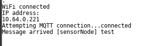

## Connecting to connecting_to_wifi
Now we’ll connect to the WiFi Network - using a simple function setup_wifi() that we’ll write somewhere in our code and call it in setup();
```
#include <ESP8266WiFi.h>

#define WIFI_SSID "WorkshopNet"
#define WIFI_PASSWORD "iotworkshop"

void setup() {              
  Serial.begin(115200);   
  setup_wifi();
}

void loop() {

}

void setup_wifi() {

  delay(10);

  Serial.println();
  Serial.print("Connecting to ");
  Serial.println(WIFI_SSID);

  WiFi.begin(WIFI_SSID, WIFI_PASSWORD);

  while (WiFi.status() != WL_CONNECTED) {
    delay(500);
    Serial.print(".");
  }

  randomSeed(micros());

  Serial.println("");
  Serial.println("WiFi connected");
  Serial.println("IP address: ");
  Serial.println(WiFi.localIP());
}

```
It just uses the WiFi library from the core package, calls the .begin() method with SSID and PASSWORD as statically defined on top and then waits until we successfully connect to the network.

Write the function, upload the sketch and check the output in the serial manager. If the IP address appears there, you’re good to go further.


## MQTT connection from ESP8266
Now we’ll connect to the MQTT broker from ESP8266. To do that we’ll need to a PubSubClient library to our sketch and then write some functions.
To install the library you need to find it via the Library Manager. It’s available via: Sketch -> Add Library -> Manage Libraries menu. Just search for “pubsubclient” in the search box and install it.

### Headers and defines
Now let’s write functions that we’ll need. First of all let’s add needed headers and defines:
```
#include <ESP8266WiFi.h>
#include <PubSubClient.h>

#define WIFI_SSID "WorkshopNet"
#define WIFI_PASSWORD "iotworkshop"

#define MQTT_SERVER "10.64.0.55"
#define SENSOR_NAME "yourName"

WiFiClient espClient;
PubSubClient client(espClient);
```
Replace `"yourName"` with your name and first letter of your surname - so everyone uses one of his own.

### reconnect() - maintaining connectivity with the broker
Then, write a  reconnect()  functionthat’s going to maintain connectivity with the broker:
```
void reconnect() {
  // Loop until we're reconnected
  while (!client.connected()) {
    Serial.print("Attempting MQTT connection...");
    // Create a random client ID
    String clientId = "ESP8266Client-";
    clientId += String(random(0xffff), HEX);
    // Attempt to connect
    if (client.connect(clientId.c_str())) {
      Serial.println("connected");
      client.publish(SENSOR_NAME, "hello world");
      client.subscribe(SENSOR_NAME);
    } else {
      delay(5000);
    }
  }
}
```
### callback() - triggered when some message arrives at the device
Next, write a simple callback function that is going to be triggered every time that some message arrives in our device.
It just prints out the topic and payload of the message that arrived.

```
void callback(char* topic, byte* payload, unsigned int length) {
  Serial.print("Message arrived [");
  Serial.print(topic);
  Serial.print("] ");
  for (int i = 0; i < length; i++) {
    Serial.print((char)payload[i]);
  }
  Serial.println();
}
```


### setup() and loop()
At last let’s update our setup and loop functions:
```
void setup() {
  Serial.begin(115200);
  setup_wifi();
  client.setServer(MQTT_SERVER, 1883);
  client.setCallback(callback);
}
void loop() {
  if (!client.connected()) {
    reconnect();
  }
  client.loop();
}
```

In the setup we perform client initialization and setup -> we set the MQTT server and port (default 1883) and attach a callback function.
In the loop if the client is not connected we call the reconnect() function to get the connection back.
Then, as often as possible, we call client.loop() so the incoming messages get parsed correctly.

Upload the sketch and check whether it is parsed correctly. Ask the instructor to display incoming messages at the broker so you’re sure that your sketch worked correctly.


## Sending and receving messages with MQTT from web
We can use a web tool to monitor data that we pass to broker via additional websockets listener in the broker.
Go to the tool here:
```
http://www.hivemq.com/demos/websocket-client/
```
And configure it as follows: the client id should remain a random value


After successfully configuring connection subscribe to your topic, by clicking on the "Add New Topic Subscription" and entering "yourName".
After resetting the board you should see the "hello world" message sent by your board.


You can as well test the communication the other way, by sending a test message to "yourName" topic - it should pop up in the serial monitor.


## Sending data from MQTT

Now we’ll send simple data over MQTT, let’s do a similar thing that we’ve done when testing Serial communication - we’ll just send an iterator over MQTT to the broker.
```
uint8_t i = 0;
void loop() {
  if (!client.connected()) {
    reconnect();
  }
  client.loop();
  client.publish(SENSOR_NAME,String(i++).c_str());
  delay(1000);
}
```
Upload the sketch and observe the values on the screen. Like mentioned previously - the client.loop() should be called as often as possible. And the above code is ‘blocking’ - the sketch ‘stops’ for a second when you use delay(1000) - it’s not a good idea, by design.

Let’s change it into nonblocking code:
```
uint8_t i = 0;
unsigned long lastDataSent = 0
void loop() {
  if (!client.connected()) {
    reconnect();
  }
  client.loop();
  if(lastDataSent + 1000 < millis()){
    client.publish(SENSOR_NAME,String(i++).c_str());
    lastDataSent = millis();
  }
}
```
This way we always save the current time in milliseconds when we send data and do it every second, but without blocking.
You can as well check if it’s working properly using the web tool.

### Receving commands via MQTT
Now we will try something different - let's try to control the status of a digital output via MQTT. It could be used eg. to control a status of a lamp, AC or something similar.

First of all - let's set the `LED_BUILTIN` GPIO as digital output:
```
void setup() {
  pinMode(LED_BUILTIN, OUTPUT);
  Serial.begin(115200);
  setup_wifi();
  client.setServer(MQTT_SERVER, 1883);
  client.setCallback(callback);
}
```

Then - let's add a subscription to the reconnect function:
```
void reconnect() {
  // Loop until we're reconnected
  while (!client.connected()) {
    Serial.print("Attempting MQTT connection...");
    // Create a random client ID
    String clientId = "ESP8266Client-";
    clientId += String(random(0xffff), HEX);
    // Attempt to connect
    if (client.connect(clientId.c_str())) {
      Serial.println("connected");
      client.publish(SENSOR_NAME, "hello world");
      client.subscribe("yourName");
      //Added subscription:

      client.subscribe("yourNameControl");


    } else {
      delay(5000);
    }
  }
}
```

And at last let's prepare the logic that will actually control the output:
```
void callback(char* topic, byte* payload, unsigned int length) {
  Serial.print("Message arrived [");
  Serial.print(topic);
  Serial.print("] ");
  for (int i = 0; i < length; i++) {
    Serial.print((char)payload[i]);
  }
  Serial.println();

  if(strcmp(topic, "yourNameControl") == 0){
    if ((char)payload[0] == '1') {
      digitalWrite(LED_BUILTIN, HIGH);
    } else {
      digitalWrite(LED_BUILTIN, LOW);
    }
  }
}
```
Upload the code and try to send `1` or `0` to `yourNameControl` topic and see whether the LED lights up.
You might notice that something is not exactly right - how will you fix it?

### Move to the next excersise
*Please save the sketch for further use - we will build on top of it in the next excersises.*

[OneWire temperature and humidity sensor](dht11.md)


In case something went wrong - you should end up with something like this:
```
#include <ESP8266WiFi.h>
#include <PubSubClient.h>

#define WIFI_SSID "WorkshopNet"
#define WIFI_PASSWORD "iotworkshop"

#define MQTT_SERVER "10.64.0.55"
#define SENSOR_NAME "yourName"

WiFiClient espClient;
PubSubClient client(espClient);

void setup() {
  pinMode(LED_BUILTIN, OUTPUT);
  Serial.begin(115200);
  setup_wifi();
  client.setServer(MQTT_SERVER, 1883);
  client.setCallback(callback);
}

uint8_t i = 0;
void loop() {
  if (!client.connected()) {
    reconnect();
  }
  client.loop();
  client.publish(SENSOR_NAME,String(i++).c_str());
}
void callback(char* topic, byte* payload, unsigned int length) {
  Serial.print("Message arrived [");
  Serial.print(topic);
  Serial.print("] ");
  for (int i = 0; i < length; i++) {
    Serial.print((char)payload[i]);
  }
  Serial.println();

  if(strcmp(topic, "yourNameControl") == 0){
    if ((char)payload[0] == '1') {
      digitalWrite(LED_BUILTIN, LOW);
    } else {
      digitalWrite(LED_BUILTIN, HIGH);
    }
  }
}
void reconnect() {
  // Loop until we're reconnected
  while (!client.connected()) {
    Serial.print("Attempting MQTT connection...");
    // Create a random client ID
    String clientId = "ESP8266Client-";
    clientId += String(random(0xffff), HEX);
    // Attempt to connect
    if (client.connect(clientId.c_str())) {
      Serial.println("connected");
      client.publish(SENSOR_NAME, "hello world");
      client.subscribe("sensorNode");
      client.subscribe("yourNameControl");

    } else {
      delay(5000);
    }
  }
}
void setup_wifi() {

  delay(10);

  Serial.println();
  Serial.print("Connecting to ");
  Serial.println(WIFI_SSID);

  WiFi.begin(WIFI_SSID, WIFI_PASSWORD);

  while (WiFi.status() != WL_CONNECTED) {
    delay(500);
    Serial.print(".");
  }

  randomSeed(micros());

  Serial.println("");
  Serial.println("WiFi connected");
  Serial.println("IP address: ");
  Serial.println(WiFi.localIP());
}
```
