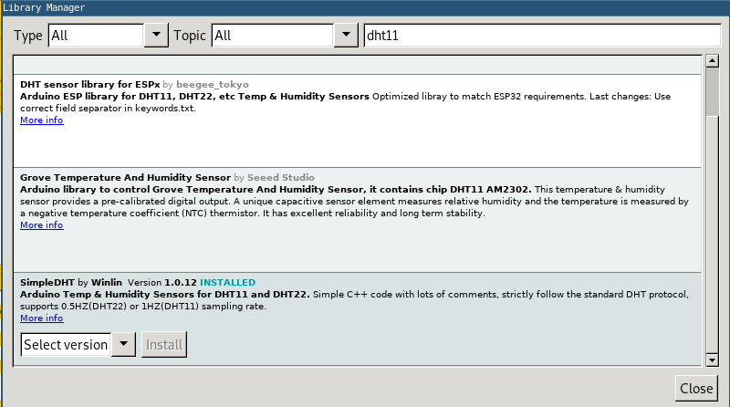

## Connecting the DHT11 sensor to wemos d1

Start by connecting the DHT11 sensor to your board
//TODO Fritzing schematic!

## Installing DHT11 library

Now we'll search for a suitable library to work with that sensor:


Let's install SimpleDHT.

Now let's open `Examples->SimpleDHT->DHT11Default` example code:
```
#include <SimpleDHT.h>

// for DHT11,
//      VCC: 5V or 3V
//      GND: GND
//      DATA: 2
int pinDHT11 = 2;
SimpleDHT11 dht11(pinDHT11);

void setup() {
  Serial.begin(115200);
}

void loop() {
  // start working...
  Serial.println("=================================");
  Serial.println("Sample DHT11...");

  // read without samples.
  byte temperature = 0;
  byte humidity = 0;
  int err = SimpleDHTErrSuccess;
  if ((err = dht11.read(&temperature, &humidity, NULL)) != SimpleDHTErrSuccess) {
    Serial.print("Read DHT11 failed, err="); Serial.println(err);delay(1000);
    return;
  }

  Serial.print("Sample OK: ");
  Serial.print((int)temperature); Serial.print(" *C, ");
  Serial.print((int)humidity); Serial.println(" H");

  // DHT11 sampling rate is 1HZ.
  delay(1500);
}
```

Upload the code and test whether the sensor is working.

Now let's clean up the code so we clearly see only the parts that we'll actually use:
```
#include <SimpleDHT.h>
int pinDHT11 = 2;
SimpleDHT11 dht11(pinDHT11);

void setup() {
  Serial.begin(115200);
}

void loop() {
  byte temperature = 0;
  byte humidity = 0;
  int err = SimpleDHTErrSuccess;
  if ((err = dht11.read(&temperature, &humidity, NULL)) != SimpleDHTErrSuccess) {
    return;
  }

  Serial.print((int)temperature); Serial.print(" *C, ");
  Serial.print((int)humidity); Serial.println(" H");

  delay(1500);
}
```
## Sending sensor data via MQTT
Now let's go back to our previous sketch and add a function that will get the measurements from the sensor and send it via MQTT.
First - let's add the include and dht object at the top of our code:
```
#include <ESP8266WiFi.h>
#include <PubSubClient.h>

#include <SimpleDHT.h>
int pinDHT11 = 2;
SimpleDHT11 dht11(pinDHT11);

#define WIFI_SSID "WorkshopNet"
#define WIFI_PASSWORD "iotworkshop"

#define MQTT_SERVER "10.64.0.55"
#define SENSOR_NAME "yourName"
```

Then let's write the function:

```
void measureTempAndHumidity(){
  byte temperature = 0;
  byte humidity = 0;
  int err = SimpleDHTErrSuccess;
  if ((err = dht11.read(&temperature, &humidity, NULL)) != SimpleDHTErrSuccess) {
    return;
  }

  client.publish("yourName/Temperature", String(temperature).c_str());
  client.publish("yourName/Humidity", String(humidity).c_str());
}
```

And now let's modify our loop so it sends the data from the sensor every two seconds:
```
unsigned long lastMeasurement = 0 ;
void loop() {
  if (!client.connected()) {
    reconnect();
  }
  client.loop();
  if(lastMeasurement + 2000 < millis()){
    measureTempAndHumidity();
    lastMeasurement = millis();
  }
}
```

## DeepSleep with ESP8266
ESP8266 has deep sleep funcitonality allowing it to significantly lower its power consumption and then wake after extended period of time.

Let's try to use it, just add: `ESP.deepSleep(10000000);` after sending the data and upload the sketch.
```
void measureTempAndHumidity(){
  byte temperature = 0;
  byte humidity = 0;
  int err = SimpleDHTErrSuccess;
  if ((err = dht11.read(&temperature, &humidity, NULL)) != SimpleDHTErrSuccess) {
    return;
  }

  client.publish("yourName/Temperature", String(temperature).c_str());
  client.publish("yourName/Humidity", String(humidity).c_str());
  ESP.deepSleep(10000000);
}
```

It will *not* work yet. You need to connect GPIO16 (marked as D0 on Wemos board) with RST. This will allow the board to wake after sleeping.
While experimenting with this - be aware that having this connection might break possibility to reprogram the board. Just unplug it if you have any issues.

Now you should be able to observe that the boards wakes up, connects to the WiFi, sends the data and then goes to sleep for 10 seconds. Just to repeat the process.
If youset the timer to something like 30 minutes you could *kinda* have a wireless sensor node running on two AA batteries for a while. It will drain the batteries fairly quick though, as DHT11 is not a perfect solution for that case, as mentioned during the presentation

## Next excersise:

[I2C pressure sensor](bmp280.md)

Code sample:

```
#include <ESP8266WiFi.h>
#include <PubSubClient.h>

#include <SimpleDHT.h>
int pinDHT11 = 2;
SimpleDHT11 dht11(pinDHT11);

#define WIFI_SSID "WorkshopNet"
#define WIFI_PASSWORD "iotworkshop"

#define MQTT_SERVER "10.64.0.55"
#define SENSOR_NAME "yourName"

WiFiClient espClient;
PubSubClient client(espClient);
void measureTempAndHumidity(){
  byte temperature = 0;
  byte humidity = 0;
  int err = SimpleDHTErrSuccess;
  if ((err = dht11.read(&temperature, &humidity, NULL)) != SimpleDHTErrSuccess) {
    return;
  }

  client.publish("yourName/Temperature", String(temperature).c_str());
  client.publish("yourName/Humidity", String(humidity).c_str());
  ESP.deepSleep(10000000);
}
void setup() {
  pinMode(LED_BUILTIN, OUTPUT);
  Serial.begin(115200);
  setup_wifi();
  client.setServer(MQTT_SERVER, 1883);
  client.setCallback(callback);
}

unsigned long lastMeasurement = 0 ;
void loop() {
  if (!client.connected()) {
    reconnect();
  }
  client.loop();
  if(lastMeasurement + 2000 < millis()){
    measureTempAndHumidity();
    lastMeasurement = millis();
  }
}
void callback(char* topic, byte* payload, unsigned int length) {
  Serial.print("Message arrived [");
  Serial.print(topic);
  Serial.print("] ");
  for (int i = 0; i < length; i++) {
    Serial.print((char)payload[i]);
  }
  Serial.println();

  if(strcmp(topic, "yourNameControl") == 0){
    if ((char)payload[0] == '1') {
      digitalWrite(LED_BUILTIN, LOW);
    } else {
      digitalWrite(LED_BUILTIN, HIGH);
    }
  }
}
void reconnect() {
  // Loop until we're reconnected
  while (!client.connected()) {
    Serial.print("Attempting MQTT connection...");
    // Create a random client ID
    String clientId = "ESP8266Client-";
    clientId += String(random(0xffff), HEX);
    // Attempt to connect
    if (client.connect(clientId.c_str())) {
      Serial.println("connected");
      client.publish(SENSOR_NAME, "hello world");
      client.subscribe("sensorNode");
      client.subscribe("yourNameControl");

    } else {
      delay(5000);
    }
  }
}
void setup_wifi() {

  delay(10);

  Serial.println();
  Serial.print("Connecting to ");
  Serial.println(WIFI_SSID);

  WiFi.begin(WIFI_SSID, WIFI_PASSWORD);

  while (WiFi.status() != WL_CONNECTED) {
    delay(500);
    Serial.print(".");
  }

  randomSeed(micros());

  Serial.println("");
  Serial.println("WiFi connected");
  Serial.println("IP address: ");
  Serial.println(WiFi.localIP());
}
```
