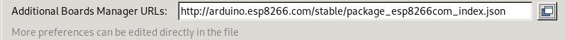
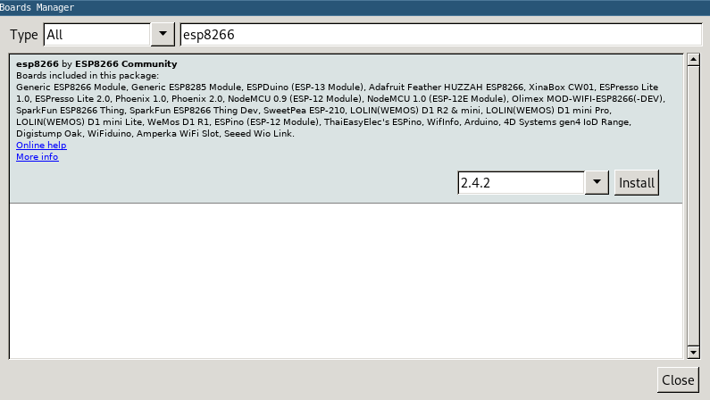
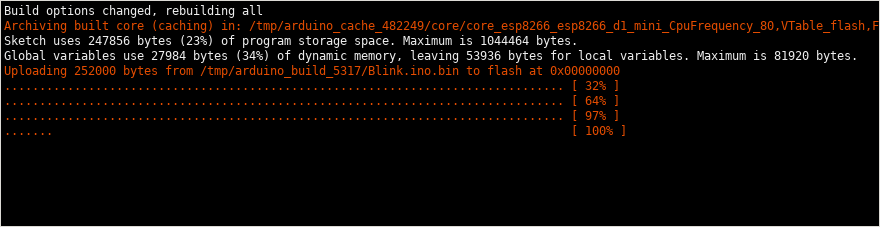
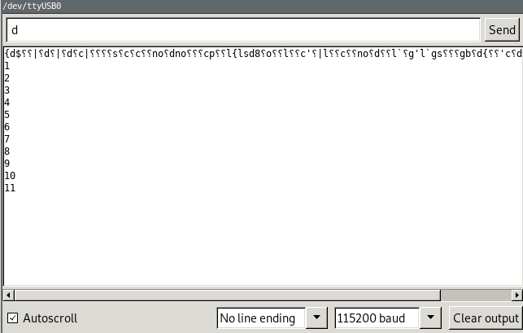

##Install ESP8266 Arduino core in the Arduino IDE

Head to Arduino ESP8266 Core project page on Github: https://github.com/esp8266/Arduino

From there copy the Board Manager Link:
```
http://arduino.esp8266.com/stable/package_esp8266com_index.json
```

Paste it in the “additional board manager links” in the Arduino IDE Preferences (you can just press Ctrl+ ,  (control plus comma) to open it):



Then open the “Board Manager” from Tools -> Board -> Board Manager
Type “esp8266” into the search box and install the package that pops up.



After installing choose a “Wemos D1 R2 & mini” Board from the Tools -> Board menu.
At the bottom right corner of the IDE you should see a line that looks something like this:  


##Connect the Wemos D1 R2 mini board and Blink an LED!
Connect the board to your computer (in case you’ve unplugged it after installing the driver).
Choose a correct COM port from the Tools -> Port (eg. correct /dev/ttyUSB[N], or COM[N]).

When the board is plugged and functional please try the first example available in the menu:
File -> Examples -> 01.Basics -> Blink
```
void setup() {
  // initialize digital pin LED_BUILTIN as an output.
  pinMode(LED_BUILTIN, OUTPUT);
}

// the loop function runs over and over again forever
void loop() {
  digitalWrite(LED_BUILTIN, HIGH);   // turn the LED on (HIGH is the voltage level)
  delay(1000);                       // wait for a second
  digitalWrite(LED_BUILTIN, LOW);    // turn the LED off by making the voltage LOW
  delay(1000);                       // wait for a second
}
```
Just make sure that there is LED_BUILTIN used as an output rather than number 13 and press the Upload button in the IDE (arrow going right)


You should see an upload log similar to this:


In case you see an error message (example below) please try:
* just repeating the upload again
* checking if the COM /ttyUSB port is set correctly
* resetting the board (using a button on it) and repeating
* starting the upload and then pressing the reset button after a few blinks of the on board


##Writing output to serial
Now we’ll test the Serial console communication between the board and the computer.
Modify a bit the previous sketch:
```
void setup() {
  // initialize digital pin LED_BUILTIN as an output.
  pinMode(LED_BUILTIN, OUTPUT);
  Serial.begin(115200);
}

uint8_t i = 0;
void loop() {
  digitalWrite(LED_BUILTIN, HIGH);   // turn the LED on (HIGH is the voltage level)
  delay(1000);                       // wait for a second
  digitalWrite(LED_BUILTIN, LOW);    // turn the LED off by making the voltage LOW
  delay(1000);                       // wait for a second
  Serial.println(i++);
}
```

In the setup you’ll initialize the Serial output at a baudrate of 115200 and in loop just print an incremented iterator.
Upload the sketch, and open the serial monitor in the ArduinoIDE.


Remember to set the same baudrate in the serial monitor, as we’ve used in the code:

In case you see just garbage and no real data - just reboot the board with reset button.
