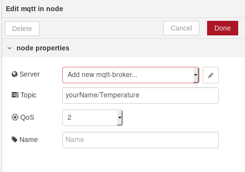
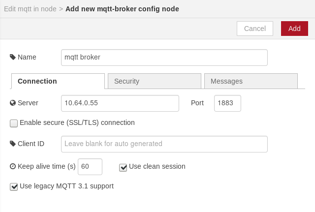
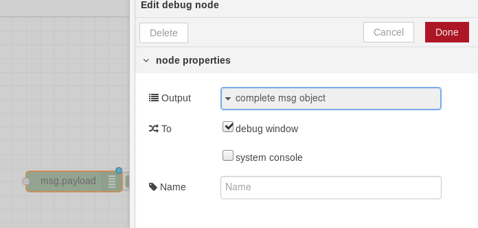
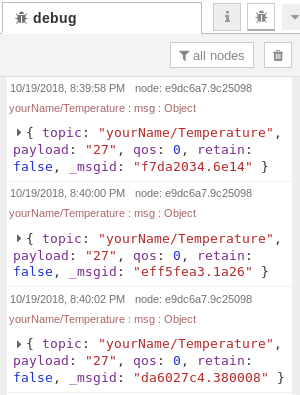
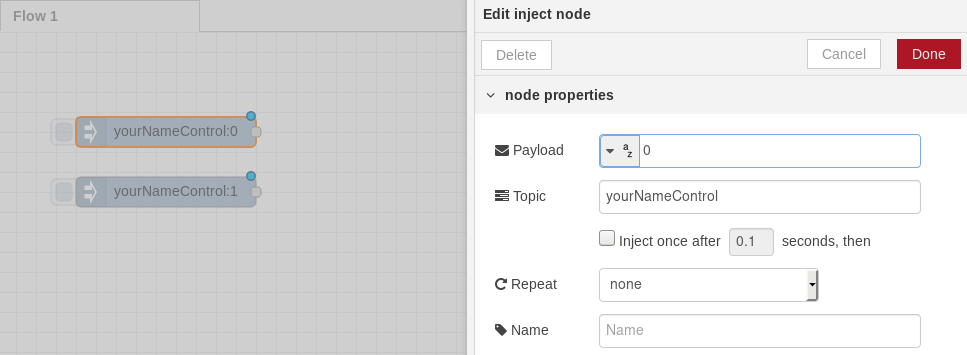
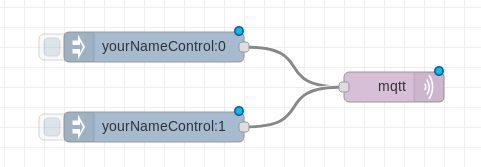
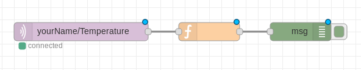
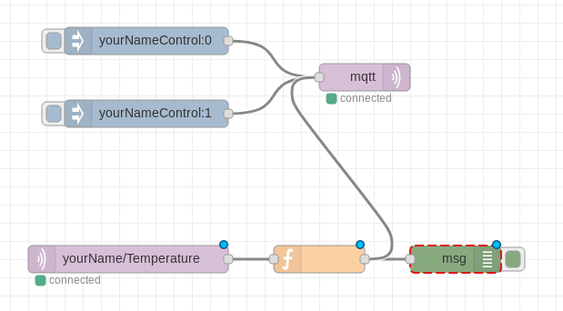

## Basics of Node-RED

## Getting data from MQTT and displaying it in the debug pane

Start by dragging an MQTT input block into your flow:


Double click it to open configuration pane:

Insert the topic name `yourName/Temperature` and click the edit button next to the server settings and configure the broker:


Next - drag a debug block into your flow and configure it to display a complete msg object:


Connect these two and click deploy in right upper corner. After clicking into the bug icon right below deploy you should be able to see flowing mqtt messages there.


## Sending data to your device

Now let's try the other way. Let's first drag two inject blocks into the flow, double click them and set them to output a string with "0", or "1" into the topic "yourNameControl".



Next - add an mqtt output block (double click it and confirm default configuration), and connect it to the inject blocks:



Try clicking the blue buttons next to the inject blocks - you should see that the messages arrive at your device, and the LED state should change.

## Creating triggers in Node-RED

Now let's throw a function block between our MQTT input and debug output:

A function block is an object allowing you to type simple JavaScript logic into the system. Now you can try to write a threshold that will light up the LED when the temperature exceedes certain threshold:
```
if(parseInt(msg.payload)>28)
    msg.payload = "1";
else
    msg.payload = "0";

msg.topic="yourNameControl"
return msg;
```
Look at the debug output to see if the output value changes with the temperatuer of the sensor.

If so - connect it to the MQTT output:


Now you have a simple alarm triggering on temperature rise.

## Simple data filtering
You can use Node-RED as well to do some data filtering.
For example it often makes a sense not to send data that has not changed its value.

You can make another function block with something like this

```
var lastTemperatureValue = context.get('lastTemperatureValue')||5000;

if (msg.payload == lastTemperatureValue)
    return null;
else{
    context.set('lastTemperatureValue', msg.payload)
    return msg;
}
```
Now you should see events happening only when the temperature value actually changes.

## Data averaging
I'll leave this up to you - but you can easily average the input data by storing the sum in one context value, an iterator in another and then at N occurencies you can just calculate the average and pass it furhter into the system.

## Integration with Cloud Services
You can use NodeRED as well to integrate with cloud platforms like DeviceHub, AWS, Azure etc.
