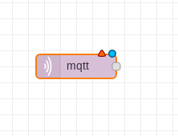

## Basics of Node-RED

## Getting data from MQTT and displaying it in the debug pane

Start by dragging an MQTT input block into your flow:

Double click it to open configuration pane:

Insert the topic name `yourName/Temperature` and click the edit button next to the server settings and configure the broker:

Next - drag a debug block into your flow and configure it to display a complete msg object:

Connect these two and click deploy in right upper corner. After clicking into the bug icon right below deploy you should be able to see flowing mqtt messages there.

## Sending data to your device

## Simple data filtering

## Creating triggers in Node-RED
